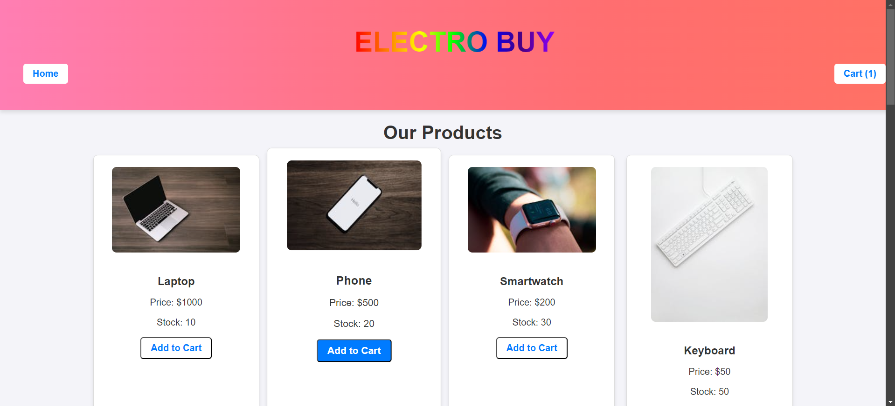

# Electro Buy - E-Commerce Web Application
## Overview
Electro Buy is an easy-to-use e-commerce website developed with the use of Flask. Peewee ORM was used for database interaction. The customers can see products, add them into the cart, and checkout using the application. This lets the user manage their shopping cart: add and remove elements from it, change item quantity, and place the order. This application also considers a responsive and fluid UI with a modern look-and-feel.

## Technologies and Tools
**Flask:** The application's backend is constructed and managed using this lightweight Python web framework.  
**Peewee ORM:** A basic Object-Relational Mapping (ORM) library for managing the data model, storing product and order data, and interacting with databases.  
**SQLite:** Product, order, and user data are stored in SQLite, a small, file-based database. Although it is the default database, a more capable alternative may be used in its place if necessary.  
**Flask-Session:** A Flask extension that lets users store their cart information in between requests by enabling session management.  
**HTML/CSS:** The foundational web technologies used to create the frontend's structure and style are HTML and CSS.  
**JavaScript:** Client-side scripting for dynamic tasks like managing user interactions, adding items to the cart, and updating the cart count.  
**Jinja2:** The templating engine used to render dynamic content, such as displaying product details, cart contents, and checkout forms.  

## Key Features
1. Product Catalog: Customers can peruse a list of the goods that are offered in the shop. Every product's name, cost, and stock level are shown. 
4. Add to Cart: Each product has the “Add to Cart” button which enables customers to select the items they want to purchase. Real time, the application updates the cart count accordingly.
3. Shopping Cart: This part shows all the products that the user has chosen on the left side, it also contains the product name, price, quantity and the total price. Customers are allowed to manage their cart which they can include more items, remove items, change quantity and also view the cart summary.
4. Checkout: To place an order, users can enter their personal information (name, email, and address) on the application's straightforward checkout form. 
5. Order History: All information about an order is saved in the form of a database after an order is placed.  
6. Responsive UI: To make the user interface more flexible to use on any size of the screen the web application has been developed using the responsive web design.  
7. Session Management: The app uses Flask-Session to manage the shopping cart in the user’s session, this means that the user can add items into the cart, switch to other pages and when they come back the cart will still be there.  
8. Dynamic Product Pages: The product pages are constructed using Jinja2 which is a template library for Flask, thus the product details such as image paths and texts are loaded dynamically.

## Purpose of the project
Electro Buy's main objective is to develop a functional and user-friendly e-commerce platform prototype. The app is meant to serve as a teaching tool and illustrate the essential features of online shopping, including cart management, product browsing, and order placement. It offers a strong basis for developing a complete e-commerce application, even though it lacks sophisticated features like inventory management and integration with a legitimate payment gateway.

## Illustration of the website
1. This is the Home Page of the website.
 

2. When "Add to cart" button is clicked, the items are added into the cart.
 

3. We can add ample number of items in the cart until there is stock available.
 

4. All the added can be seen in the cart.
 

5. By clicking "+" button, we can increase the quantity.
 

6. By clicking "-" button, we can decrease the quantity.
 

7. We can also remove the item from the cart by clicking "Remove" button.
 

8. After clicking "Proceed to checkout", checkout page will open where the user credentials are entered.
 

9. After filling out all the required details, and clicking "Place Order", the item will be placed.

## Future Work
1. Payment Integration: The following are some of the features that include integrating with major payment processors such as or PayPal for real payments during the checkout process.
2. User Authentication: User authentication where customers can create an account, login and monitor their orders.
3. Inventory Management: Real time stock control which changes product quantity in store according to the purchases made.
4. Admin Panel: This is where the administrators can be able to control the orders, products, and the inventory as it relates to the orders.
5. Email Notifications: The system will through the use of emails inform the user with the order numbers and details when a user places an order.
6. Product Search & Filters: Allows the users to sort the products by name, price and other characteristics.
